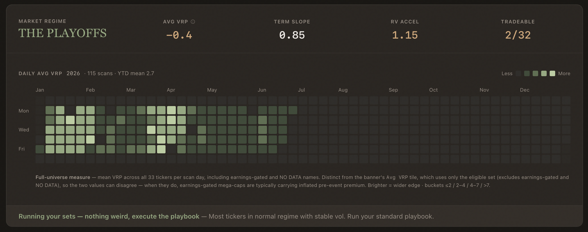

<a id="readme-top"></a>

<div align="center">



<p><em>A volatility-premium scanner for options sellers — it scores premium-selling edge <b>0–100</b> from IV rank, the volatility risk premium, term structure, skew, and market regime.</em></p>

<p>


</p>

<p>
<a href="https://theta.thevixguy.com"><b>🌐 Live Demo</b></a> &nbsp;·&nbsp;
<a href="#-how-scoring-works">📊 How Scoring Works</a> &nbsp;·&nbsp;
<a href="#-quick-start">🚀 Quick Start</a>
</p>

<!-- 📹 DEMO — record the "scan → drill into a signal" loop, save it as assets/demo.gif, then uncomment:

-->
<sub><em>📹 Demo GIF coming soon — record the dashboard and drop it at <code>assets/demo.gif</code>.</em></sub>

</div>

---

## Table of Contents

- [About](#about)
- [✨ Key Features](#-key-features)
- [🛠 Built With](#-built-with)
- [🚀 Quick Start](#-quick-start)
- [📊 How Scoring Works](#-how-scoring-works)
- [🏗 Architecture](#-architecture)
- [🖼 Screenshots](#-screenshots)
- [🗺 Roadmap](#-roadmap)
- [📄 License](#-license)
- [🙏 Acknowledgments](#-acknowledgments)

## About

Options are systematically overpriced: implied volatility (what the market expects) tends to exceed realized volatility (what actually happens), because traders overpay for protection. That gap — the **Volatility Risk Premium (VRP)** — is a harvestable edge for premium sellers.

**Theta Harvest** scans a curated universe of 33 liquid US equities and ETFs every trading day, scores each name's premium-selling edge from **0–100**, and surfaces the conditions where the edge is widest *and* the market structure actually supports harvesting it. It doesn't predict direction — it measures *how favorable* conditions are for selling options right now, and steps aside when they aren't.

Built for quant-minded options traders — and as a working example of a full **data → scoring → dashboard** pipeline.

## ✨ Key Features

- **0–100 edge score** from five additive components — VRP Quality, IV Percentile, Term Structure, RV Stability, and Skew.
- **Regime detection** — per-ticker (`NORMAL` / `CAUTION` / `DANGER`) plus an at-a-glance, NBA-themed market regime (**THE FINALS · THE PLAYOFFS · REGULAR SEASON · OFF SEASON**).
- **Automated daily scan** of 33 tickers across 7 sectors, after market close.
- **Credit Put Spreads tab** — a defined-risk expression of the same edge (SPY / QQQ / IWM), with construction + execution filters and 2-day confirmation.
- **Day-over-day deltas** plus a GitHub-style **VRP activity grid** for trend context.
- **Dark / light theme**, responsive dashboard.
- **Self-healing history automation** that logs each day's metrics and an AI-written market briefing.

## 🛠 Built With

| Layer | Stack |
|---|---|
| **Backend** | Python 3.12 · FastAPI · NumPy · Pydantic · APScheduler · SQLite (WAL) |
| **Frontend** | Next.js 14 · React 18 · TypeScript · Recharts · Tailwind CSS |
| **Infra** | Docker Compose · Cloudflare Tunnel · AWS Lightsail |
| **Data** | [MarketData.app](https://www.marketdata.app) (options/stocks) · [FMP](https://financialmodelingprep.com) (earnings) · [yfinance](https://github.com/ranaroussi/yfinance) (VIX / VIX3M / VVIX) |

## 🚀 Quick Start

```bash
git clone https://github.com/victorhwn7255/options-premium-selling-dashboard.git
cd options-premium-selling-dashboard

export MARKETDATA_TOKEN=your_token_here   # required
export FMP_API_KEY=your_key_here          # optional (earnings dates)

docker compose up --build
```

- **Dashboard** → http://localhost:3000
- **Backend API** → http://localhost:8030

<details>
<summary><b>Local dev (without Docker) &amp; tests</b></summary>

```bash
# backend
cd backend && pip install -r requirements.txt
export MARKETDATA_TOKEN=your_token_here
python main.py                                # uvicorn on :8000

# frontend
cd frontend && npm install && npm run dev     # :3000

# tests
cd backend
python test_calculator.py
python -m pytest test_liquidity_filter.py -v
```
</details>

## 📊 How Scoring Works

Every ticker gets a single **0–100 edge score**. It's purely additive — no penalties — so it reads cleanly as *"how much edge is present?"*

| Component | Max | Measures |
|---|--:|---|
| **VRP Quality** | 30 | Is implied vol rich vs. realized? (`IV / RV30`) |
| **IV Percentile** | 25 | Are options expensive vs. their own 1-year history? |
| **Term Structure** | 20 | Contango (favorable) vs. backwardation (danger)? |
| **RV Stability** | 15 | Is realized vol calm or accelerating? (`RV10 / RV30`) |
| **Skew** | 10 | Is there 25-delta put demand to harvest? |

**Gates & overrides:** earnings within 14 days → `SKIP`; negative VRP caps the score at 44; a **DANGER** regime (deep backwardation) forces `AVOID` regardless of score. Otherwise: **≥ 65 → SELL**, **≥ 45 → CONDITIONAL**.

> Full detail: [`context/1-domain/scoring-and-strategy.md`](context/1-domain/scoring-and-strategy.md) · strategy thesis in [`references/strategy.md`](references/strategy.md) · defined-risk spreads in [`references/credit-put-spreads.md`](references/credit-put-spreads.md).

## 🏗 Architecture

A two-service stack. A **FastAPI** backend is the single source of truth — it fetches data, computes every metric, runs the composite score, and executes the daily scan after market close (6:30 PM ET). A **Next.js** frontend renders the dashboard and passes the backend's scores through unchanged. Persistence is **SQLite (WAL) + per-ticker CSVs**; post-scan results are cross-checked against Yahoo Finance.

> Deep dive: [`context/2-system/architecture.md`](context/2-system/architecture.md).

## 🖼 Screenshots

<!-- Replace the placeholders below with real screenshots, then uncomment:
| Leaderboard | Ticker detail | Regime banner |
|---|---|---|
|  |  |  |
-->
<sub><em>Screenshots coming soon — add <code>assets/screenshot-leaderboard.png</code>, <code>-detail.png</code>, <code>-regime.png</code>.</em></sub>

## 🗺 Roadmap

- [ ] **Journal tab** — trade entry, exits, P/L, score-at-entry (Phase 6)
- [ ] **Credit Put Spreads** universe expansion (EEM / TLT / XLE)
- [ ] **Portfolio-level Greeks** aggregation

## 📄 License

Released under the **MIT License**.

## 🙏 Acknowledgments

- [MarketData.app](https://www.marketdata.app) — options & stock market data
- [Financial Modeling Prep](https://financialmodelingprep.com) — earnings dates
- [yfinance](https://github.com/ranaroussi/yfinance) — VIX / VIX3M / VVIX overlay

<p align="right"><a href="#readme-top">↑ Back to top</a></p>
